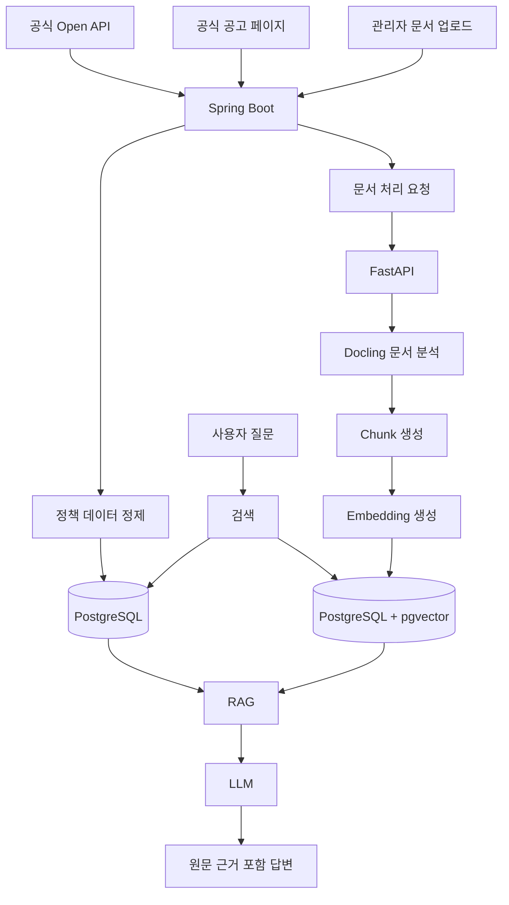

# 청년정책 아카이브 AI

> 흩어진 청년 지원정책을 수집·아카이빙하고, 사용자의 조건에 맞는 정책을 공식 원문 근거와 함께 찾아주는 AI 기반 청년정책 검색 서비스

---

## 1. 프로젝트 소개

청년을 위한 금융, 자산형성, 주거, 취업, 교육, 복지 정책은 여러 정부기관과 지방자치단체에 흩어져 있습니다.

공고마다 신청 조건과 표현 방식이 다르고, 중요한 내용이 PDF·표·이미지 형태의 첨부파일에 포함되어 있어 사용자가 자신에게 맞는 정책을 직접 찾고 비교하기 어렵습니다.

**청년정책 아카이브 AI**는 공식 Open API와 공식 공고 문서를 기반으로 청년정책 정보를 수집·보관하고, 이후 RAG와 멀티모달 문서 분석 기술을 활용하여 사용자의 질문에 **공식 원문 근거가 포함된 답변**을 제공하는 것을 목표로 합니다.

단순한 AI 챗봇이 아니라,

**정책 수집 → 구조화 → 아카이빙 → 검색 → 문서 검색 → AI 답변**

으로 이어지는 전체 데이터 흐름을 구현하는 것이 프로젝트의 핵심입니다.

---

## 2. 현재 개발 상태

현재는 **1인 개발 프로젝트**로 진행하고 있습니다.

Codex를 개발 보조 에이전트로 활용하되, 한 번에 작은 기능을 구현하고 직접 코드와 동작을 검토하는 방식으로 개발합니다.

### 현재 단계

```text
Backend MVP 초기 구축
```

현재 가장 먼저 구현할 범위는 다음과 같습니다.

1. Spring Boot 프로젝트 구성
2. PostgreSQL 연동
3. Policy 도메인 구현
4. 정책 CRUD
5. 조건별 정책 검색
6. 공식 Open API 연동

아직 RAG, AI Agent, 멀티모달, 웹 크롤링 등은 구현하지 않습니다.

---

## 3. 해결하고 싶은 문제

### 3.1 정책 정보가 여러 곳에 흩어져 있다

청년정책을 찾기 위해 여러 정부기관 및 지방자치단체 사이트를 각각 검색해야 합니다.

### 3.2 공고문이 복잡하다

중요한 신청 조건이 긴 공고문이나 첨부 PDF 안에 포함되어 있는 경우가 많습니다.

### 3.3 나에게 해당하는 정책인지 판단하기 어렵다

연령, 지역, 취업 여부, 소득 등 정책마다 조건이 다르기 때문에 사용자가 직접 모든 조건을 비교해야 합니다.

### 3.4 정책 변경 내용을 확인하기 어렵다

같은 정책이라도 연도별 또는 수정 공고별로 신청기간, 지원금액, 제출서류 등이 달라질 수 있습니다.

### 3.5 AI 답변의 신뢰성을 확인하기 어렵다

AI가 정책을 설명하더라도 답변의 출처가 없다면 실제 신청 과정에서 신뢰하기 어렵습니다.

---

## 4. 프로젝트 목표

이 프로젝트는 다음을 목표로 합니다.

* 여러 곳에 흩어진 청년정책을 한곳에서 검색
* 지역·나이·정책 분야 등 구조화된 조건 검색
* 공식 정책 데이터를 주기적으로 수집
* 정책 원문과 첨부 문서 아카이빙
* PDF·표·이미지 공고문 분석
* 자연어 기반 정책 검색
* 사용자 조건과 정책 신청조건 비교
* AI 답변에 공식 원문 근거 표시
* 정책 수정 및 연도별 변경 이력 관리
* 확인할 수 없는 조건은 임의로 판단하지 않고 `확인 필요`로 표시

---

# 5. 주요 기능

## 5.1 정책 검색

정책을 다음 조건으로 검색합니다.

* 정책명
* 정책 분야
* 대상 지역
* 대상 연령
* 취업 상태
* 소득 조건
* 신청기간
* 모집 상태

초기 MVP에서는 자연어 검색보다 **정확한 DB 조건 검색을 먼저 구현**합니다.

---

## 5.2 정책 상세 조회

정책별로 다음 정보를 제공합니다.

* 정책명
* 정책 분야
* 주관 기관
* 지원 내용
* 대상 지역
* 대상 연령
* 신청 시작일
* 신청 종료일
* 모집 상태
* 신청 방법
* 공식 원문 URL

이후 문서 분석 기능이 추가되면 다음 정보도 제공합니다.

* 첨부 문서
* AI 요약
* 신청 자격 상세조건
* 관련 원문 페이지
* 근거 문장

---

## 5.3 자연어 정책 검색

RAG 단계에서 사용자는 일반적인 문장으로 정책을 검색할 수 있습니다.

예시:

```text
서울에 거주하는 만 29세 미취업자가
현재 신청할 수 있는 자산형성 정책을 알려줘.
```

```text
직장인이 신청할 수 있는 청년 금융정책을 비교해줘.
```

자연어 검색은 일반 DB 검색이 안정적으로 구현된 이후 추가합니다.

---

## 5.4 자격조건 예비 진단

사용자가 입력한 조건과 정책 신청조건을 비교합니다.

예시:

| 조건    | 판단    |
| ----- | ----- |
| 나이    | 충족    |
| 거주지   | 충족    |
| 취업 상태 | 충족    |
| 소득 조건 | 확인 필요 |
| 신청기간  | 접수 중  |

판단 결과는 다음 세 단계로 구분합니다.

* `충족`
* `불충족`
* `확인 필요`

서비스가 실제 신청 가능 여부를 확정하지 않습니다.

확인할 수 없는 조건은 추측하지 않고 공식 신청기관 확인이 필요하다고 안내합니다.

---

## 5.5 정책 비교

두 개 이상의 정책을 주요 조건별로 비교합니다.

예시:

| 비교 항목 | 정책 A | 정책 B |
| ----- | ---- | ---- |
| 대상 연령 |      |      |
| 소득 기준 |      |      |
| 신청기간  |      |      |
| 지원 금액 |      |      |
| 가입기간  |      |      |
| 신청 방법 |      |      |

AI가 임의로 가장 좋은 정책을 결정하기보다 각 정책의 조건과 차이를 근거와 함께 설명하는 것을 목표로 합니다.

---

## 5.6 공식 원문 근거 제공

RAG 답변에는 가능한 경우 다음 정보를 함께 제공합니다.

* 출처 기관
* 정책명
* 공고명
* 공고일
* 공식 원문 URL
* 첨부 문서명
* 문서 페이지
* 관련 원문

예시:

```text
신청일 기준 만 19세 이상 34세 이하인 청년이 대상입니다.

근거
- 문서: 2026년 청년지원사업 모집공고.pdf
- 위치: 3페이지 신청자격
```

AI가 답변을 생성하는 것보다 **어떤 근거로 답변했는지 추적할 수 있는 구조**를 중요하게 다룹니다.

---

## 5.7 정책 아카이빙 및 변경 이력

같은 정책의 수정 공고나 연도별 공고를 별도 버전으로 관리합니다.

관리 대상 예시:

* 최초 수집일
* 공고일
* 이전 버전
* 최신 버전
* 신청기간 변경
* 소득 기준 변경
* 지원 금액 변경
* 제출서류 변경

향후 다음과 같은 질문을 지원하는 것이 목표입니다.

```text
지난해 공고와 올해 공고에서 달라진 점을 알려줘.
```

---

## 5.8 관리자 문서 업로드

관리자가 정책 관련 공식 문서를 직접 등록할 수 있도록 구현할 예정입니다.

우선 지원 대상:

* PDF
* 이미지

추후 필요에 따라:

* 웹페이지 URL
* HWP 변환 문서

등을 검토합니다.

문서는 다음과 같은 처리 상태를 갖습니다.

```text
PENDING
   ↓
PROCESSING
   ↓
PARSING
   ↓
EMBEDDING
   ↓
COMPLETED
```

실패한 경우:

```text
FAILED
```

상태와 오류 내용을 기록합니다.

---

## 5.9 정책 자동 수집

정책 정보는 다음 우선순위로 수집합니다.

```text
1. 공식 Open API
       ↓
2. 공식 정책 상세 페이지
       ↓
3. 공식 첨부 문서
       ↓
4. 관리자 직접 업로드
       ↓
5. 필요한 사이트에 한정한 크롤링
```

처음부터 여러 사이트를 무차별적으로 크롤링하지 않습니다.

가능한 경우 공식 API를 최우선으로 사용합니다.

---

# 6. 전체 서비스 흐름

최종적으로 다음 구조를 목표로 합니다.



---

# 7. 기술 스택

기술은 한 번에 모두 도입하지 않습니다.

**현재 필요한 기술부터 추가하는 방식**으로 개발합니다.

## Frontend

| 기술             | 사용 목적            | 도입 시점          |
| -------------- | ---------------- | -------------- |
| Next.js        | 사용자 및 관리자 Web UI | Backend MVP 이후 |
| React          | UI 구성            | Backend MVP 이후 |
| TypeScript     | 타입 안정성           | Backend MVP 이후 |
| Tailwind CSS   | UI 스타일링          | Backend MVP 이후 |
| TanStack Query | 서버 상태 관리         | Backend MVP 이후 |

---

## Backend

| 기술               | 사용 목적          | 도입 시점             |
| ---------------- | -------------- | ----------------- |
| Java 17          | Backend 개발 언어  | 현재                |
| Spring Boot      | Backend API 서버 | 현재                |
| Spring Web       | REST API       | 현재                |
| Bean Validation  | 요청 데이터 검증      | 현재                |
| Spring Data JPA  | DB 접근          | PostgreSQL 단계     |
| Spring Scheduler | 정책 주기적 수집      | Open API 단계       |
| Spring Batch     | 대량 작업·재시작 관리   | 필요해질 경우           |
| Spring Security  | 인증·인가          | 추후                |
| JWT              | 사용자 인증         | 추후                |
| WebClient        | 외부 Open API 호출 | Open API 단계       |
| Jsoup            | 정적 HTML 파싱     | 크롤링 필요 시          |
| Playwright       | 동적 페이지 수집      | Jsoup으로 처리 불가능할 때 |

---

## AI / Document Processing

| 기술               | 사용 목적          | 도입 시점     |
| ---------------- | -------------- | --------- |
| Python           | AI 및 문서 처리     | RAG 단계    |
| FastAPI          | AI 처리 API 서버   | RAG 단계    |
| Docling          | PDF·표·문서 구조 분석 | 문서 처리 단계  |
| Embedding Model  | 문서 벡터화         | RAG 단계    |
| LLM API          | 답변 생성          | RAG 단계    |
| RAG              | 문서 기반 질의응답     | RAG 단계    |
| Multimodal Model | 이미지·스캔 공고 분석   | 필요 시      |
| LangGraph        | Agent Workflow | 마지막 확장 단계 |

초기에는 LangChain/LangGraph에 의존하지 않고 기본적인 RAG 흐름을 먼저 직접 구현합니다.

```text
질문
 ↓
Embedding
 ↓
관련 문서 검색
 ↓
Top-K Chunk
 ↓
Prompt 구성
 ↓
LLM
 ↓
답변 + 출처
```

이 구조가 안정된 이후 Agent 기능을 추가합니다.

---

## Database

| 기술         | 사용 목적                        | 도입 시점       |
| ---------- | ---------------------------- | ----------- |
| PostgreSQL | 정책 및 문서 메타데이터 저장             | Backend MVP |
| pgvector   | Embedding 저장 및 Vector Search | RAG 단계      |

정책의 나이, 지역, 신청기간 등은 SQL 조건 검색으로 처리하고,

문장의 의미를 기반으로 한 검색이 필요한 경우 pgvector를 사용합니다.

최종적으로 다음과 같은 **Hybrid Search** 구조를 목표로 합니다.

```text
SQL 조건 검색
      +
Vector Search
      ↓
관련 정책 및 문서 검색
```

---

## Storage

| 기술            | 사용 목적             | 도입 시점    |
| ------------- | ----------------- | -------- |
| Local Storage | 초기 문서 처리 테스트      | 초기 개발    |
| MinIO         | 로컬 Object Storage | 문서 관리 단계 |
| AWS S3        | 실제 배포 파일 저장       | 배포 단계    |

PDF 자체를 PostgreSQL에 저장하기보다 파일 저장소에 저장하고 DB에는 파일의 메타데이터와 저장 위치를 관리합니다.

---

## Infrastructure

| 기술             | 사용 목적          | 도입 시점      |
| -------------- | -------------- | ---------- |
| Git / GitHub   | 버전 관리          | 현재         |
| Codex          | AI 기반 개발 보조    | 현재         |
| Docker         | 실행 환경 통일       | 필요 시       |
| Docker Compose | DB 및 서비스 로컬 구성 | 필요 시       |
| GitHub Actions | CI/CD          | MVP 안정화 이후 |
| Cloud          | 실제 서비스 배포      | 최종 단계      |

---

# 8. 시스템 구성

## 1차 MVP

```text
Client
   ↓
Spring Boot
   ↓
PostgreSQL
```

가장 먼저 이 구조를 완성합니다.

---

## 2차 MVP

```text
Next.js
   ↓
Spring Boot
   ↓
PostgreSQL
```

정책 검색 Web UI를 추가합니다.

---

## RAG 단계

```text
Next.js
   ↓
Spring Boot
   ├──────────────→ PostgreSQL
   │
   └──────────────→ FastAPI
                       ↓
                     Docling
                       ↓
                    Embedding
                       ↓
                    pgvector
                       ↓
                      LLM
```

Spring Boot가 서비스의 중심 역할을 담당하고,

FastAPI는 AI 및 문서 처리 기능에 집중합니다.

---

# 9. 데이터 수집 전략

## 9.1 공식 Open API

가장 먼저 사용합니다.

```text
Official API
    ↓
WebClient
    ↓
Response DTO
    ↓
변환
    ↓
Policy
    ↓
PostgreSQL
```

외부 API DTO와 내부 Entity를 직접 연결하지 않고 별도로 관리합니다.

---

## 9.2 정적 웹페이지

API에서 제공되지 않는 정보가 필요할 경우 Jsoup을 사용합니다.

```text
공식 Web Page
      ↓
WebClient
      ↓
HTML
      ↓
Jsoup
      ↓
필요 정보 추출
```

---

## 9.3 동적 웹페이지

JavaScript 실행 이후 데이터가 나타나는 사이트에 한해서 Playwright 사용을 검토합니다.

```text
Open API
   ↓
Jsoup
   ↓
Playwright
```

순서로 선택합니다.

---

# 10. 문서 처리

공식 공고 PDF는 다음 흐름으로 처리할 예정입니다.

```text
PDF
 ↓
파일 저장
 ↓
Docling
 ↓
제목 / 본문 / 표 / 페이지 분석
 ↓
Chunk 생성
 ↓
Embedding
 ↓
pgvector
```

단순 텍스트 추출이 어려운 경우에만 OCR 또는 멀티모달 분석을 적용합니다.

---

# 11. RAG 처리 과정

## 문서 수집

* 공식 공고문
* 공식 첨부 PDF
* 관리자 업로드 문서

## 문서 분석

* PDF 텍스트 추출
* 제목 및 소제목 파악
* 표 구조 분석
* 페이지 번호 보존

## Chunk 생성

예상 분리 기준:

* 신청자격
* 지원내용
* 신청기간
* 신청방법
* 제출서류
* 유의사항

각 Chunk에는 검색에 필요한 메타데이터를 함께 저장합니다.

```json
{
  "policyId": 1,
  "documentId": 10,
  "documentName": "2026년 청년지원사업 모집공고.pdf",
  "page": 3,
  "section": "신청자격",
  "sourceUrl": "공식 원문 URL"
}
```

## 검색

다음 검색 방식을 함께 사용할 예정입니다.

* SQL 조건 검색
* 키워드 검색
* Vector Search
* 정책 메타데이터 필터링

## 답변 생성

검색된 공식 문서의 내용을 바탕으로 답변합니다.

근거가 부족한 경우 임의로 내용을 생성하지 않습니다.

예시:

```text
현재 저장된 공고만으로는 해당 소득 조건을 확인할 수 없습니다.

공식 신청 페이지에서 추가 확인이 필요합니다.
```

---

# 12. AI Agent

RAG 시스템이 안정적으로 동작한 이후 AI Agent 기능을 추가합니다.

Agent가 사용할 수 있는 도구의 예시는 다음과 같습니다.

```text
searchPolicies()
```

조건에 맞는 정책을 검색합니다.

```text
getPolicyDetail()
```

정책 상세 내용을 조회합니다.

```text
checkEligibility()
```

사용자 조건과 정책 신청조건을 비교합니다.

```text
comparePolicies()
```

여러 정책을 비교합니다.

```text
findSourceEvidence()
```

답변 근거가 되는 공고문 내용을 찾습니다.

```text
getPolicyHistory()
```

정책 변경 이력을 조회합니다.

Agent 기능은 LangGraph를 활용하는 것을 고려하고 있지만, 기본 RAG가 완성되기 전에는 도입하지 않습니다.

---

# 13. 주요 데이터 모델

현재 아래 모델은 **설계 예정안**이며 실제 개발 과정에서 변경될 수 있습니다.

## Policy

정책 자체의 기본 정보를 관리합니다.

| 필드                   | 설명        |
| -------------------- | --------- |
| id                   | 정책 ID     |
| name                 | 정책명       |
| category             | 정책 분야     |
| organization         | 주관 기관     |
| region               | 대상 지역     |
| applicationStartDate | 신청 시작일    |
| applicationEndDate   | 신청 종료일    |
| recruitmentStatus    | 모집 상태     |
| sourceUrl            | 공식 원문 URL |

---

## PolicyEligibility

정책 신청조건을 구조화합니다.

| 필드                  | 설명        |
| ------------------- | --------- |
| policyId            | 정책 ID     |
| minimumAge          | 최소 나이     |
| maximumAge          | 최대 나이     |
| region              | 거주 지역     |
| employmentStatus    | 취업 상태     |
| incomeCondition     | 소득 조건     |
| educationCondition  | 학력 조건     |
| additionalCondition | 기타 조건     |
| sourceEvidence      | 조건의 원문 근거 |

---

## PolicyVersion

정책의 수정 또는 연도별 공고를 관리합니다.

| 필드                | 설명       |
| ----------------- | -------- |
| id                | 버전 ID    |
| policyId          | 정책 ID    |
| version           | 버전       |
| announcementDate  | 공고일      |
| previousVersionId | 이전 버전    |
| changeSummary     | 변경 내용    |
| isLatest          | 최신 버전 여부 |

---

## PolicyDocument

정책과 연결된 공식 문서를 관리합니다.

| 필드               | 설명        |
| ---------------- | --------- |
| id               | 문서 ID     |
| policyId         | 정책 ID     |
| fileName         | 파일명       |
| fileType         | 파일 형식     |
| storageUrl       | 파일 저장 위치  |
| sourceUrl        | 공식 원문 URL |
| fileHash         | 파일 Hash   |
| processingStatus | 처리 상태     |
| collectedAt      | 수집 일시     |

파일 Hash는 동일한 문서가 다시 수집되었는지 확인하고 수정 공고를 탐지하는 데 활용할 수 있습니다.

---

## DocumentChunk

RAG 검색에 사용하는 문서 조각입니다.

| 필드         | 설명               |
| ---------- | ---------------- |
| id         | Chunk ID         |
| documentId | 문서 ID            |
| pageNumber | 문서 페이지           |
| section    | 문서 영역            |
| content    | 본문               |
| embedding  | Embedding Vector |
| metadata   | 검색 메타데이터         |

---

## IngestionJob

정책 또는 문서 처리 작업의 상태를 관리합니다.

| 필드           | 설명     |
| ------------ | ------ |
| id           | 작업 ID  |
| jobType      | 작업 종류  |
| status       | 작업 상태  |
| startedAt    | 시작 시간  |
| finishedAt   | 종료 시간  |
| retryCount   | 재시도 횟수 |
| errorMessage | 오류 내용  |

---

# 14. 개발 로드맵

## Phase 1. Backend 기반

현재 진행 단계입니다.

* [ ] Spring Boot 프로젝트 초기화
* [ ] 기본 테스트 실행
* [ ] PostgreSQL 연결
* [ ] JPA 설정
* [ ] Policy Entity 설계
* [ ] Policy DTO 구현
* [ ] Policy Repository 구현
* [ ] Policy Service 구현
* [ ] Policy API 구현

---

## Phase 2. 정책 검색

* [ ] 정책 목록 조회
* [ ] 정책 상세 조회
* [ ] 정책 등록
* [ ] 정책 수정
* [ ] 정책 삭제
* [ ] 지역 검색
* [ ] 정책 분야 검색
* [ ] 나이 조건 검색
* [ ] 여러 조건 조합 검색
* [ ] 검색 테스트 작성

---

## Phase 3. 정책 데이터 수집

* [ ] 공식 Open API 조사
* [ ] WebClient 연동
* [ ] 외부 API DTO 정의
* [ ] 내부 Policy 모델 변환
* [ ] 중복 정책 처리
* [ ] Scheduler 기반 주기적 동기화
* [ ] 수집 실패 로그 처리

---

## Phase 4. Frontend

* [ ] Next.js 프로젝트 생성
* [ ] 정책 목록
* [ ] 정책 검색
* [ ] 정책 상세
* [ ] 기본 관리자 화면
* [ ] Spring Boot API 연동

---

## Phase 5. 문서 관리

* [ ] PDF 업로드
* [ ] 파일 저장
* [ ] 파일 Hash 생성
* [ ] 문서 처리 상태 관리
* [ ] FastAPI 서버 생성
* [ ] Docling 연결
* [ ] PDF 구조 분석
* [ ] 문서 Chunk 생성

---

## Phase 6. RAG

* [ ] pgvector 도입
* [ ] Embedding 생성
* [ ] DocumentChunk 저장
* [ ] Vector Search
* [ ] SQL + Vector Hybrid Search
* [ ] LLM 연결
* [ ] RAG 답변 생성
* [ ] 답변에 문서·페이지 근거 표시

---

## Phase 7. 자격조건 진단

* [ ] PolicyEligibility 구조화
* [ ] 사용자 조건 입력
* [ ] 충족 판정
* [ ] 불충족 판정
* [ ] 확인 필요 판정
* [ ] 판정 근거 표시

---

## Phase 8. 정책 아카이빙

* [ ] 동일 정책 식별
* [ ] 파일 Hash 비교
* [ ] PolicyVersion 생성
* [ ] 최신 버전 관리
* [ ] 변경 내용 분석
* [ ] 이전 버전 비교

---

## Phase 9. AI Agent

* [ ] Agent Tool 설계
* [ ] 정책 검색 Tool
* [ ] 상세 조회 Tool
* [ ] 자격조건 확인 Tool
* [ ] 정책 비교 Tool
* [ ] 근거 검색 Tool
* [ ] 정책 이력 Tool
* [ ] LangGraph Workflow
* [ ] 복합 질문 처리

---

# 15. 1인 개발 원칙

이 프로젝트는 현재 1인 개발 프로젝트입니다.

따라서 기술의 개수보다 **완성 가능성과 이해 가능한 구조**를 우선합니다.

### 원칙

* 한 번에 하나의 작은 기능만 구현합니다.
* 동작하는 가장 단순한 구조를 먼저 선택합니다.
* 미래 확장성을 이유로 현재 필요하지 않은 기술을 도입하지 않습니다.
* 새로운 라이브러리는 필요성이 확인된 후 도입합니다.
* 기존 코드를 불필요하게 대규모 수정하지 않습니다.
* 기능 구현 후 테스트합니다.
* 구현 이유를 설명할 수 없는 코드는 그대로 사용하지 않습니다.

### MVP에서 사용하지 않는 기술

현재 다음 기술은 도입하지 않습니다.

```text
Kafka
Redis
Kubernetes
Elasticsearch
Microservices
```

실제 문제가 발생하고 해당 기술이 필요한 이유가 생기는 경우에만 도입 여부를 검토합니다.

---

# 16. Codex 활용 원칙

Codex를 코드 작성 및 개발 보조 도구로 사용합니다.

Codex에게 프로젝트 전체를 한 번에 구현하도록 맡기지 않고 작은 작업 단위로 진행합니다.

```text
요구사항 정의
      ↓
Codex 작업 계획 확인
      ↓
구현 승인
      ↓
Codex 구현
      ↓
Test
      ↓
코드 Review
      ↓
Commit
```

Codex에 작업을 요청할 때는 다음 형식을 기본으로 사용합니다.

```text
[목표]

구현하려는 기능


[요구사항]

필요한 동작


[제약사항]

변경하면 안 되는 부분
사용하면 안 되는 기술


[완료 조건]

테스트
빌드
API 동작 여부
```

### Merge / Commit 기준

다음 질문에 답할 수 없는 코드는 그대로 반영하지 않습니다.

* 이 클래스는 왜 필요한가?
* 요청이 어떤 흐름으로 처리되는가?
* 데이터가 어디에 저장되는가?
* 이 라이브러리를 왜 사용했는가?
* 오류가 발생하면 어디에서 확인할 수 있는가?
* 테스트는 무엇을 검증하는가?

---

# 17. 현재 디렉터리 구조

```text
youth-policy-archive-ai/
│
├── backend/
│   └── Spring Boot
│
├── frontend/
│   └── Next.js
│
├── ai-server/
│   └── FastAPI
│
├── docs/
│   └── 프로젝트 문서
│
├── AGENTS.md
├── README.md
└── .gitignore
```

현재는 `backend`부터 구현합니다.

`frontend`와 `ai-server`는 해당 개발 단계에 도달했을 때 초기화합니다.

---

# 18. AI 품질 평가

RAG 기능 구현 이후 AI 답변을 다음 기준으로 평가할 예정입니다.

| 평가 항목   | 설명                        |
| ------- | ------------------------- |
| 검색 정확도  | 질문과 관련된 정책을 찾았는가          |
| 조건 정확도  | 나이·지역·소득 등의 조건을 정확히 처리했는가 |
| 근거 정확도  | 답변 내용이 실제 원문에 존재하는가       |
| 인용 정확도  | 올바른 문서와 페이지를 제시했는가        |
| 최신성     | 최신 정책 데이터를 기준으로 답했는가      |
| 환각 방지   | 문서에 없는 정보를 생성하지 않았는가      |
| 불확실성 표현 | 확인할 수 없는 정보를 단정하지 않았는가    |

예시:

```text
질문

서울 거주 만 28세 미취업자가
신청할 수 있는 금융 지원정책은?


검증

- 서울 또는 전국 대상 정책인가?
- 연령 조건을 충족하는가?
- 취업 상태 조건을 충족하는가?
- 현재 모집 중인가?
- 공식 원문 근거가 존재하는가?
```

---

# 19. MVP 범위

## 1차 MVP

AI보다 **정책 데이터 수집과 검색 서비스** 완성에 집중합니다.

* 정책 CRUD
* 조건별 정책 검색
* PostgreSQL 저장
* 공식 Open API 연동
* 정책 데이터 자동 동기화
* 기본 Web UI

## 2차 MVP

문서 기반 AI 기능을 추가합니다.

* PDF 업로드
* 문서 분석
* Chunk 생성
* Embedding
* pgvector
* 자연어 검색
* RAG
* 공식 원문 근거 표시

## 이후 확장

* 정책 자격조건 예비 진단
* 정책 비교
* 정책 버전 관리
* 멀티모달 문서 분석
* AI Agent
* 변경 이력 비교

---

# 20. MVP 제외 범위

현재 프로젝트에서는 다음 기능을 우선 구현하지 않습니다.

* 모든 정부기관 사이트 크롤링
* 주민등록번호 수집
* 실제 소득정보 자동 조회
* 실제 신청 가능 여부 확정
* 모든 HWP 문서 완벽 지원
* 모바일 앱
* 커뮤니티
* 결제
* 복잡한 알림 시스템
* 대규모 분산 시스템

---

# 21. 프로젝트 차별점

이 프로젝트는 단순한 청년정책 챗봇보다 다음 기능에 집중합니다.

1. 정책 구조화 데이터와 공식 공고 문서를 함께 관리합니다.
2. AI 답변에 문서명과 페이지 등 원문 근거를 제공합니다.
3. 확인할 수 없는 조건을 임의로 판단하지 않습니다.
4. 수정 공고와 연도별 정책 변경 내용을 아카이빙합니다.
5. SQL 조건 검색과 Vector Search를 함께 활용합니다.
6. 표와 이미지가 포함된 정책 문서까지 분석하는 것을 목표로 합니다.
7. 정책 수집부터 AI 답변까지의 전체 데이터 흐름을 직접 구현합니다.

---

# 22. 화면 구성

## 사용자

* 메인
* 정책 검색
* 정책 검색 결과
* 정책 상세
* 자연어 AI 검색
* 정책 비교
* 자격조건 예비 진단
* 관심 정책

## 관리자

* 정책 관리
* 정책 수집 상태
* 문서 업로드
* 문서 처리 상태
* 실패 작업 확인
* 정책 버전 관리
* AI 답변 로그
* 검색된 Document Chunk 확인

화면은 Backend MVP가 완성된 이후 단계적으로 구현합니다.

---

# 23. 실행 방법

현재 프로젝트 초기 개발 단계이므로 실제 프로젝트가 생성된 이후 업데이트할 예정입니다.

## Backend

예정:

```bash
cd backend

./gradlew bootRun
```

Windows:

```bash
cd backend

gradlew.bat bootRun
```

## Frontend

예정:

```bash
cd frontend

npm install
npm run dev
```

## AI Server

예정:

```bash
cd ai-server

pip install -r requirements.txt

uvicorn main:app --reload
```

## Docker

예정:

```bash
docker compose up -d
```

---

# 24. 환경변수

실제 기능을 구현하면서 필요한 환경변수를 단계적으로 추가합니다.

예정 예시:

```env
# Database
DB_HOST=
DB_PORT=
DB_NAME=
DB_USERNAME=
DB_PASSWORD=

# Public Data API
YOUTH_POLICY_API_KEY=

# AI
LLM_API_KEY=
EMBEDDING_API_KEY=

# Storage
STORAGE_ENDPOINT=
STORAGE_ACCESS_KEY=
STORAGE_SECRET_KEY=
```

API Key, 비밀번호 및 Secret 값은 Git Repository에 Commit하지 않습니다.

---

# 25. 프로젝트 문서

추후 `docs` 디렉터리에서 관리할 예정입니다.

* ERD
* API 명세
* 기능 명세
* 시스템 아키텍처
* 정책 데이터 수집 기준
* RAG 구조
* AI 평가 데이터셋
* 테스트 결과

---

# 26. 주의사항

본 서비스가 제공하는 정책 정보와 자격조건 분석 결과는 참고 정보입니다.

실제 신청 가능 여부와 최종 선정 여부는 각 정책의 공식 신청기관이 결정합니다.

서비스는 확인할 수 없는 조건을 임의로 추측하여 `신청 가능`이라고 판단하지 않으며, 필요한 경우 공식 공고문 또는 신청기관에서 추가 확인하도록 안내합니다.

---

# 27. License

라이선스는 추후 결정할 예정입니다.
