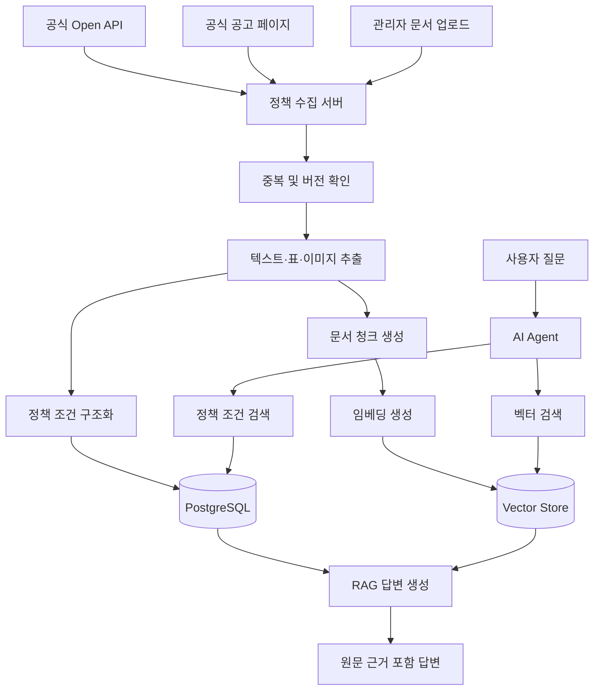

# 청년정책 아카이브 AI

> 흩어진 청년 지원정책을 수집·아카이빙하고, 사용자의 조건에 맞는 정책을 원문 근거와 함께 찾아주는 AI Agent

## 1. 프로젝트 소개

청년을 위한 적금, 주거, 취업, 교육, 복지 정책은 여러 정부기관과 지방자치단체 사이트에 흩어져 있습니다.

공고마다 신청 조건과 표현 방식이 다르고, 중요한 내용이 PDF나 이미지 형태의 첨부파일에 포함되어 있어 사용자가 자신에게 맞는 정책을 직접 찾고 비교하기 어렵습니다.

**청년정책 아카이브 AI**는 공식 Open API, 공고 페이지, 업로드된 문서를 통해 청년정책 정보를 수집하고, RAG와 멀티모달 기술을 활용해 사용자의 질문에 원문 근거와 함께 답변하는 서비스입니다.

---

## 2. 프로젝트 목표

이 프로젝트는 단순한 정책 검색 챗봇이 아니라 다음 문제를 해결하는 것을 목표로 합니다.

* 여러 사이트에 흩어진 청년정책을 한곳에서 검색할 수 있도록 합니다.
* PDF와 이미지에 포함된 자격요건을 분석합니다.
* 사용자의 조건과 정책 조건을 비교해 신청 가능성을 안내합니다.
* AI 답변에 공고명, 원문 링크, 페이지 등 명확한 근거를 제공합니다.
* 같은 정책의 수정 공고와 연도별 변경 이력을 저장합니다.
* 확실하지 않은 조건은 단정하지 않고 `확인 필요`로 표시합니다.

---

## 3. 주요 사용자

### 정책을 찾는 청년

* 현재 신청할 수 있는 정책을 찾고 싶은 사용자
* 자신의 나이, 거주지, 취업 상태에 맞는 정책을 찾고 싶은 사용자
* 청년 적금이나 자산형성 정책을 비교하고 싶은 사용자
* 복잡한 공고문을 쉽게 이해하고 싶은 사용자

### 정책을 관리하는 운영자

* 새로운 정책 문서를 등록하는 관리자
* 문서 처리 및 AI 분석 상태를 확인하는 관리자
* 중복 공고와 수정 공고를 관리하는 관리자
* AI 답변의 근거와 품질을 검수하는 관리자

---

## 4. 핵심 기능

### 4.1 청년정책 검색

다음 조건을 이용해 정책을 검색할 수 있습니다.

* 정책명 및 키워드
* 정책 분야
* 거주 지역
* 나이
* 취업 상태
* 소득 조건
* 신청기간
* 모집 상태

검색 결과에는 단순 정책 목록뿐 아니라 사용자의 조건과 일치하는 이유를 함께 제공합니다.

---

### 4.2 자연어 기반 정책 탐색

사용자는 일반적인 문장으로 정책을 검색할 수 있습니다.

예시:

```text
서울에 거주하는 만 29세 미취업자가 현재 신청할 수 있는 청년 적금 정책을 알려줘.
```

```text
월 소득이 있는 직장인이 가입할 수 있는 청년 자산형성 정책을 비교해줘.
```

AI Agent는 질문을 분석한 뒤 정책 검색, 자격조건 확인, 원문 조회 등의 도구를 실행합니다.

---

### 4.3 자격조건 예비 진단

사용자의 조건과 공고의 신청자격을 비교해 다음과 같이 표시합니다.

| 조건    | 판단    |
| ----- | ----- |
| 나이    | 충족    |
| 거주지   | 충족    |
| 취업 상태 | 충족    |
| 소득 조건 | 확인 필요 |
| 신청기간  | 접수 중  |

자격 여부를 확정적으로 단정하지 않고 다음 세 단계로 구분합니다.

* `충족`
* `불충족`
* `확인 필요`

최종 신청 가능 여부는 반드시 공식 신청기관에서 확인하도록 안내합니다.

---

### 4.4 정책 상세 조회

정책 상세 페이지에서 다음 내용을 확인할 수 있습니다.

* 정책명
* 지원 내용
* 신청 대상
* 나이 조건
* 거주지 조건
* 취업 상태
* 소득 조건
* 신청기간
* 지원 금액
* 제출 서류
* 신청 방법
* 주관 기관
* 공식 원문 링크
* 첨부 문서
* AI 요약
* 답변 근거

---

### 4.5 정책 비교

두 개 이상의 정책을 항목별로 비교할 수 있습니다.

| 비교 항목   | 정책 A | 정책 B |
| ------- | ---- | ---- |
| 대상 연령   |      |      |
| 소득 기준   |      |      |
| 신청기간    |      |      |
| 월 납입액   |      |      |
| 지원 금액   |      |      |
| 가입기간    |      |      |
| 중도해지 조건 |      |      |

AI는 단순히 어느 정책이 더 좋다고 판단하지 않고, 각 정책이 어떤 사용자에게 적합한지 근거와 함께 설명합니다.

---

### 4.6 원문 근거 제공

AI 답변에는 가능한 경우 다음 정보를 함께 제공합니다.

* 출처 기관
* 정책명
* 공고명
* 공고일
* 공식 원문 URL
* 첨부 문서명
* 문서 페이지
* 관련 원문 문장

예시:

```text
신청일 기준 만 19세 이상 34세 이하인 청년이 대상입니다.

근거
- 문서: 2026년 청년지원사업 모집공고.pdf
- 위치: 3페이지 신청자격
```

---

### 4.7 정책 아카이빙 및 변경 이력

같은 정책의 수정 공고나 연도별 공고를 별도 버전으로 저장합니다.

관리 항목:

* 정책별 공고 버전
* 최초 수집일
* 최종 수정일
* 이전 버전
* 최신 버전
* 신청기간 변경
* 소득 기준 변경
* 제출 서류 변경
* 지원 금액 변경

사용자는 다음과 같은 질문을 할 수 있습니다.

```text
작년 공고와 올해 공고에서 달라진 점을 알려줘.
```

---

### 4.8 관리자 문서 업로드

관리자는 정책 관련 문서를 직접 업로드할 수 있습니다.

지원 예정 형식:

* PDF
* 이미지
* 웹페이지 URL
* HWP 또는 HWP 변환 문서

문서 처리 상태는 다음 단계로 관리합니다.

```text
업로드 대기
→ 텍스트 추출
→ 이미지 및 표 분석
→ 문서 분할
→ 임베딩 생성
→ 저장 완료
```

처리에 실패한 경우 오류 내용과 재처리 기능을 제공합니다.

---

### 4.9 정책 자동 수집

정책 데이터는 다음 순서로 수집합니다.

1. 공식 Open API
2. 공식 정책 상세 페이지
3. 공식 첨부 문서
4. 관리자 직접 업로드
5. 필요한 사이트에 한정한 제한적 웹 크롤링

처음부터 모든 정부기관 사이트를 크롤링하지 않고, 공식 API와 신뢰할 수 있는 원문을 중심으로 수집합니다.

---

## 5. 서비스 동작 흐름



---

## 6. AI Agent 도구

AI Agent는 사용자의 질문에 따라 필요한 도구를 선택해 실행합니다.

```text
searchPolicies()
```

조건에 맞는 정책 목록을 검색합니다.

```text
getPolicyDetail()
```

특정 정책의 상세 내용을 조회합니다.

```text
checkEligibility()
```

사용자의 조건과 정책 자격요건을 비교합니다.

```text
comparePolicies()
```

여러 정책을 항목별로 비교합니다.

```text
findSourceEvidence()
```

답변을 뒷받침하는 공고 원문과 페이지를 찾습니다.

```text
getPolicyHistory()
```

정책의 과거 공고와 변경 이력을 조회합니다.

---

## 7. RAG 처리 과정

### 문서 수집

* 공식 API 응답 저장
* 공식 공고 페이지 수집
* 첨부 PDF 다운로드
* 관리자 문서 업로드

### 문서 분석

* PDF 텍스트 추출
* 문서 제목 및 소제목 분석
* 표 구조 분석
* 이미지 또는 스캔 문서 분석
* 페이지 번호 저장

### 청킹

문서를 다음 기준으로 나눕니다.

* 문서 제목
* 신청자격
* 지원 내용
* 신청기간
* 신청 방법
* 제출 서류
* 유의사항

각 청크에는 다음 메타데이터를 저장합니다.

```json
{
  "policyId": 1,
  "documentId": 10,
  "documentName": "2026년 청년지원사업 모집공고.pdf",
  "page": 3,
  "section": "신청자격",
  "sourceUrl": "공식 원문 URL"
}
```

### 검색

다음 검색 방식을 함께 사용하는 하이브리드 검색을 적용할 예정입니다.

* 키워드 검색
* 조건 기반 검색
* 벡터 유사도 검색
* 정책 메타데이터 필터링

### 답변 생성

검색된 문서 내용만을 바탕으로 답변을 생성합니다.

근거가 부족한 경우에는 임의로 답을 만들지 않고 다음과 같이 안내합니다.

```text
현재 저장된 공고만으로는 해당 소득 조건을 확인할 수 없습니다.
공식 신청 페이지에서 추가 확인이 필요합니다.
```

---

## 8. 멀티모달 활용

멀티모달 기술은 다음과 같은 문서를 분석하는 데 활용합니다.

* 이미지로 저장된 공고문
* 스캔 PDF
* 표 안에 자격조건이 포함된 문서
* 포스터 형태의 모집공고
* 신청 절차가 이미지로 제공되는 문서

일반 텍스트로 추출할 수 있는 문서는 기본 문서 파서를 사용하고, 텍스트 추출이 어려운 페이지만 멀티모달 모델을 사용합니다.

---

## 9. 기술 스택

> 아래 기술은 팀 구성과 개발 범위에 따라 변경될 수 있습니다.

### Frontend

* React
* Next.js
* TypeScript
* Tailwind CSS
* React Query

### Backend

* Java 17
* Spring Boot
* Spring Data JPA
* Spring Batch 또는 Scheduler
* Spring Security
* JWT

### AI

* Python
* FastAPI
* LangChain 또는 LangGraph
* LLM API
* Embedding Model
* PDF Parser
* Multimodal Model

### Database

* PostgreSQL
* pgvector

### Infrastructure

* Docker
* Docker Compose
* AWS 또는 기타 클라우드 환경
* S3 또는 MinIO
* GitHub Actions

### Collaboration

* GitHub
* Notion
* Figma
* Discord 또는 Slack

---

## 10. 시스템 구성

3인 팀에서는 하나의 Spring Boot 서버 안에 주요 기능을 구성하고, AI 문서 처리만 별도 Python 서버로 분리하는 방식을 고려합니다.

4인 팀에서는 다음과 같이 역할을 나눌 수 있습니다.

```text
Frontend
    ↓
Spring Boot API Server
    ├── 회원 및 인증
    ├── 정책 검색
    ├── 정책 상세
    ├── 관리자 기능
    ├── 데이터 수집
    └── 문서 처리 작업 관리
              ↓
        FastAPI AI Server
            ├── 문서 파싱
            ├── 청킹
            ├── 임베딩
            ├── 멀티모달 분석
            └── RAG 답변 생성
```

---

## 11. 주요 데이터 모델

### Policy

정책의 기본 정보를 관리합니다.

| 필드                   | 설명        |
| -------------------- | --------- |
| id                   | 정책 ID     |
| name                 | 정책명       |
| category             | 정책 분야     |
| organization         | 주관 기관     |
| region               | 대상 지역     |
| applicationStartDate | 신청 시작일    |
| applicationEndDate   | 신청 종료일    |
| recruitmentStatus    | 모집 상태     |
| sourceUrl            | 공식 원문 URL |
| latestVersionId      | 최신 공고 버전  |

### PolicyEligibility

정책의 신청 조건을 관리합니다.

| 필드                  | 설명        |
| ------------------- | --------- |
| policyId            | 정책 ID     |
| minimumAge          | 최소 나이     |
| maximumAge          | 최대 나이     |
| region              | 거주 지역     |
| employmentStatus    | 취업 상태     |
| incomeCondition     | 소득 조건     |
| educationCondition  | 학력 조건     |
| additionalCondition | 기타 조건     |
| sourceEvidence      | 조건의 원문 근거 |

### PolicyDocument

정책과 관련된 문서를 관리합니다.

| 필드               | 설명        |
| ---------------- | --------- |
| id               | 문서 ID     |
| policyId         | 정책 ID     |
| fileName         | 파일명       |
| fileType         | 파일 형식     |
| storageUrl       | 저장 위치     |
| sourceUrl        | 공식 원문 URL |
| fileHash         | 파일 해시     |
| processingStatus | 처리 상태     |
| collectedAt      | 수집 일시     |

### PolicyVersion

정책 공고의 변경 이력을 관리합니다.

| 필드                | 설명       |
| ----------------- | -------- |
| id                | 버전 ID    |
| policyId          | 정책 ID    |
| version           | 공고 버전    |
| announcementDate  | 공고일      |
| previousVersionId | 이전 버전    |
| changeSummary     | 변경 내용    |
| isLatest          | 최신 버전 여부 |

### DocumentChunk

RAG 검색에 사용되는 문서 조각을 관리합니다.

| 필드         | 설명       |
| ---------- | -------- |
| id         | 청크 ID    |
| documentId | 문서 ID    |
| pageNumber | 문서 페이지   |
| section    | 문서 구역    |
| content    | 본문       |
| embedding  | 임베딩 벡터   |
| metadata   | 검색 메타데이터 |

### IngestionJob

문서 수집 및 처리 작업을 관리합니다.

| 필드           | 설명     |
| ------------ | ------ |
| id           | 작업 ID  |
| jobType      | 작업 종류  |
| status       | 작업 상태  |
| startedAt    | 시작 시간  |
| finishedAt   | 종료 시간  |
| retryCount   | 재시도 횟수 |
| errorMessage | 오류 내용  |

---

## 12. 팀 구성 및 역할

### 4인 팀 기준

| 역할       | 주요 담당                               |
| -------- | ----------------------------------- |
| 백엔드·데이터  | Open API 연동, DB 설계, 배치 수집, 정책 버전 관리 |
| AI·RAG   | 문서 파싱, 청킹, 임베딩, 검색, 답변 생성           |
| 프론트엔드·UX | 정책 검색, 상세, 비교, 관리자 화면               |
| 인프라·품질   | 배포, 모니터링, 테스트, AI 답변 평가             |

### 3인 팀 기준

| 역할      | 주요 담당                     |
| ------- | ------------------------- |
| 백엔드·데이터 | API, DB, 데이터 수집, 관리자 기능   |
| AI·인프라  | RAG, 멀티모달, AI 서버, 배포      |
| 프론트엔드   | 사용자 검색, 정책 상세, 비교, 관리자 UI |

---

## 13. MVP 범위

1차 MVP에서는 모든 청년정책을 다루지 않고 한 분야에 집중합니다.

우선 적용 후보:

* 청년 적금
* 자산형성 지원
* 금융 지원
* 취업 지원

### MVP 포함 기능

* 공식 Open API 기반 정책 수집
* 정책 목록 및 상세 조회
* 지역·나이·분야 필터 검색
* 관리자 PDF 업로드
* PDF 텍스트 추출
* 문서 임베딩
* 자연어 정책 검색
* 원문 근거가 포함된 RAG 답변
* 정책 자격조건 예비 진단

### MVP 제외 기능

* 모든 정부기관 사이트 크롤링
* 주민등록번호 수집
* 실제 소득정보 자동 조회
* 실제 신청 가능 여부 확정
* 모든 HWP 문서 지원
* 모바일 앱
* 커뮤니티
* 결제 기능
* 복잡한 알림 기능

---

## 14. 개발 단계

### 1단계: 정책 검색 서비스

* 정책 데이터 모델 설계
* 공식 Open API 연동
* 정책 데이터 저장
* 조건별 검색 API
* 정책 목록 및 상세 화면

### 2단계: 문서 관리

* 관리자 문서 업로드
* 파일 저장
* 처리 상태 관리
* PDF 텍스트 추출
* 문서 청킹

### 3단계: RAG 검색

* 임베딩 생성
* 벡터 저장
* 하이브리드 검색
* 자연어 질의
* 원문 근거 표시

### 4단계: 정책 자격진단

* 사용자 조건 입력
* 정책 조건 구조화
* 충족·불충족·확인 필요 판정
* 판정 근거 표시

### 5단계: 아카이빙

* 중복 공고 확인
* 공고 버전 관리
* 변경 내용 분석
* 이전 공고와 비교

### 6단계: AI Agent

* 검색 도구 호출
* 정책 상세 조회
* 자격조건 확인
* 정책 비교
* 원문 탐색
* 복합 질문 처리

---

## 15. AI 답변 품질 평가

AI 답변은 다음 기준으로 평가합니다.

| 평가 항목   | 설명                          |
| ------- | --------------------------- |
| 검색 정확도  | 질문과 관련된 정책을 찾았는가            |
| 조건 정확도  | 나이, 지역, 소득 등의 조건을 정확히 해석했는가 |
| 근거 정확도  | 답변이 실제 원문에 존재하는가            |
| 인용 정확도  | 올바른 문서와 페이지를 표시했는가          |
| 최신성     | 최신 공고를 기준으로 답변했는가           |
| 환각 방지   | 문서에 없는 내용을 만들어내지 않았는가       |
| 불확실성 표현 | 알 수 없는 조건을 확인 필요로 표시했는가     |

테스트 질문과 기대 결과를 별도 데이터셋으로 관리할 예정입니다.

예시:

```text
질문:
서울 거주 만 28세 미취업자가 신청할 수 있는 금융 지원정책은?

검증 항목:
- 서울 또는 전국 대상 정책을 검색했는가
- 연령 조건을 충족하는가
- 미취업자 신청 가능 여부를 확인했는가
- 현재 모집 중인지 확인했는가
- 공식 원문 근거를 제시했는가
```

---

## 16. 기대 효과

### 사용자 관점

* 여러 정부기관 사이트를 일일이 방문하지 않아도 됩니다.
* 복잡한 공고문을 쉽게 이해할 수 있습니다.
* 자신의 조건에 맞는 정책을 빠르게 찾을 수 있습니다.
* AI 답변의 원문 근거를 직접 확인할 수 있습니다.
* 정책별 차이와 변경 내용을 쉽게 비교할 수 있습니다.

### 개발 관점

* 공공 Open API 연동
* 웹 데이터 수집
* 비정형 문서 처리
* RAG 검색
* 멀티모달 분석
* AI Agent 도구 호출
* 문서 버전 관리
* 백엔드 배치 처리
* AI 답변 평가

등의 기술을 하나의 서비스 흐름 안에서 경험할 수 있습니다.

---

## 17. 차별점

기존 정책 검색 서비스와 비교해 다음 기능에 집중합니다.

1. 정책 원문과 첨부 문서를 함께 검색합니다.
2. AI 답변에 문서명과 페이지를 포함한 근거를 제공합니다.
3. 신청 가능 여부를 단정하지 않고 불확실성을 표시합니다.
4. 같은 정책의 수정 공고와 연도별 변경 내용을 아카이빙합니다.
5. 텍스트뿐 아니라 표와 이미지 형태의 공고도 분석합니다.
6. 관리자 관점에서 문서 처리 및 AI 답변 품질을 관리할 수 있습니다.

---

## 18. 화면 구성

### 사용자 화면

* 메인 페이지
* 자연어 정책 검색
* 조건별 상세 검색
* 정책 검색 결과
* 정책 상세
* 정책 비교
* 자격조건 예비 진단
* 관심 정책 목록

### 관리자 화면

* 정책 관리
* 문서 업로드
* 수집 작업 관리
* 문서 처리 상태
* 실패 작업 재처리
* 정책 중복 관리
* 공고 버전 관리
* AI 답변 로그
* 검색 문서 및 청크 확인

---

## 19. 실행 방법

> 프로젝트 구현 이후 작성할 예정입니다.

### 저장소 복제

```bash
git clone [Repository URL]
cd [Project Directory]
```

### Backend 실행

```bash
cd backend
./gradlew bootRun
```

### Frontend 실행

```bash
cd frontend
npm install
npm run dev
```

### AI Server 실행

```bash
cd ai-server
pip install -r requirements.txt
uvicorn main:app --reload
```

### Docker 실행

```bash
docker compose up -d
```

---

## 20. 환경변수

```env
# Database
DB_HOST=
DB_PORT=
DB_NAME=
DB_USERNAME=
DB_PASSWORD=

# JWT
JWT_SECRET=

# AI
LLM_API_KEY=
EMBEDDING_API_KEY=

# Storage
STORAGE_ENDPOINT=
STORAGE_ACCESS_KEY=
STORAGE_SECRET_KEY=

# Public Data API
YOUTH_POLICY_API_KEY=
```

실제 API Key와 비밀번호는 저장소에 커밋하지 않습니다.

---

## 21. API 문서

> 개발 이후 Swagger 문서 주소를 추가할 예정입니다.

```text
http://localhost:8080/swagger-ui/index.html
```

---

## 22. 프로젝트 문서

* 기능 명세서: 작성 예정
* API 명세서: 작성 예정
* ERD: 작성 예정
* 화면 설계서: 작성 예정
* 아키텍처 문서: 작성 예정
* AI 평가 데이터셋: 작성 예정
* 테스트 결과: 작성 예정

---

## 23. 팀원

| 이름   | 역할      | 담당 기능            |
| ---- | ------- | ---------------- |
| 팀원 1 | 백엔드·데이터 | 정책 수집, DB, 버전 관리 |
| 팀원 2 | AI·RAG  | 문서 분석, 검색, 답변 생성 |
| 팀원 3 | 프론트엔드   | 사용자 및 관리자 화면     |
| 팀원 4 | 인프라·품질  | 배포, 모니터링, AI 평가  |

---

## 24. 주의사항

본 서비스에서 제공하는 자격진단 결과는 공고문을 바탕으로 한 참고 정보입니다.

정책의 실제 신청 가능 여부와 최종 선정 여부는 신청기관의 심사 결과에 따라 달라질 수 있습니다. 사용자는 반드시 공식 공고문과 신청기관을 통해 최종 조건을 확인해야 합니다.

---

## 25. License

본 프로젝트의 라이선스는 추후 결정할 예정입니다.
